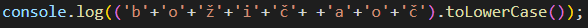

# Naloge

## 1. IZGUBLJENA PISMA BOŽIČKU

1. https://hekaton.mojedelo.com/hekaton/bozicni-it-hekaton/naloga_1/
2. >Težave v Božičkovem informacijskem sistemu.
3. > Božiček je to leto svojim IT palčkom naročil naj izdelajo informacijski sistem v katerega se shranjujejo vsa pisma želja otrok. Da bo imel lažji pregled katera darila bodo morali njegovi palčki ustvariti za otroke.
   >
   > Po več urnem sestanku so IT palčki prišli do naslednje rešitve. Odločili so se, da bodo izdelali sistem, ki bo skeniral vsa poslana sporočila in jih shranil v podatkovno bazo.
   >
   > Podatkovna baza ima dva stolpca. Prvi je Id datoteke, ki je unikaten, drugi pa pot do datoteke. Id je tipa CHAR(32), generira pa se na podlagi izračunane MD5 hash vrednosti datoteke, ki je bila skenirana.
   >
   >Dan pred božičem, so IT palčki za vsak slučaj prešteli vsa pisma, ki so jih skenirali in pa prešteli vse stolpce v bazi. Opazili so, da je število sporočil v podatkovni bazi manjše kot pa število pisem, ki so jih prejeli. Težava je definitivno v informacijskem sistemu, ki so ga naredili, saj so bila skenirana vsa sporočila.
   >
   > Ali lahko ugotoviš kako se imenuje težava do katere je prišlo? (odgovori v angleškem jeziku)
4. https://en.wikipedia.org/wiki/Hash_collision
5. `hash collision`

## 2. SLIKA

1. https://hekaton.mojedelo.com/hekaton/bozicni-it-hekaton/naloga_2/
2. >Božiček je prejel sliko in ne ve kaj bi z njo.
3. > Božiček je dobil sporočilo, v katerem piše, da se njegovo pismo nahaja v sliki ssrd/its-xmas-time. Sam ne ve, kaj to je. Mu lahko pomagaš?
4. https://hub.docker.com/r/ssrd/its-xmas-time
5. `docker image save ssrd/its-xmas-time > its-xmas-time.tar`
6. `tar xvf its-xmas-time.tar`
7. `cat tar/3ac3e9ec79c0af263a197784768f9a0133ace6bf38a79b7431a457d972f2b7bd/var/local/main/.history`
8. [.history file](2/tar/3ac3e9ec79c0af263a197784768f9a0133ace6bf38a79b7431a457d972f2b7bd/var/local/main/.history)
9. flag:RaiseAGlassForEveryone
10. `RaiseAGlassForEveryone`

## 3. PISMO BOŽIČKU

1. https://hekaton.mojedelo.com/hekaton/bozicni-it-hekaton/naloga_3/
2. >Poredni škrati.
3. > Božiček je po starem kanalu dobil sporočilo, ki pa so ga zlobni škratje spremenili.
   >
   > Božiček si razbija glavo ker ne ve kam mora dostaviti darila. Otroci bodo žalostni, v kolikor ne dobijo daril. Ali mu lahko pomagaš, kam more dostaviti del daril?
   >
   > Sporočilo: `1110 1 101 000 1110 111 010 000 1110 10 110 1011 11 0101 10 11111 11111`
4. morse koda https://cryptii.com/
5. [CyberChef Recept](https://gchq.github.io/CyberChef/#recipe=Find_/_Replace(%7B'option':'Simple%20string','string':'0'%7D,'-',true,false,false,false)Find_/_Replace(%7B'option':'Simple%20string','string':'1'%7D,'.',true,false,false,false)From_Morse_Code('Space','Line%20feed')&input=MTExMCAxIDEwMSAwMDAgMTExMCAxMTEgMDEwIDAwMCAxMTEwIDEwIDExMCAxMDExIDExIDAxMDEgMTAgMTExMTEgMTExMTEK)
6. `verovskovaulica55`

## 4. BOŽIČKOVA PAMETNA HIŠA

1. https://hekaton.mojedelo.com/hekaton/bozicni-it-hekaton/naloga_4/
2. >Božičku se samodejno odpirajo vrata.
3. >Božičkova pametna hiša ima lokalno omrežje na katerega so preko switchev povezane vse naprave v hiši (IoT, računalniki, multimedija, nadzorne kamere,...). Ker se dogajajo čudne stvari, želi Božiček za vsako skupino od teh naprav ustvariti svoje omrežje. Božiček želi zagotoviti, da lahko naprave komunicirajo samo znotraj svoje skupine. Na primer IoT naprava lahko komunicira samo z napravami, ki spadajo v IoT omrežje.
   >
   >Vse naprave so že priklopljene na več switchev, ki so L2 managed (mrežno stikalo), vsi switchi so povezani na en router (usmerjevalnik).
   >
   >Ali veš kako se imenuje kratica nastavitev za ločevanje omrežij? (angleška kratica)
4. `VLAN`

## 5. ŠIFRIRANA VOŠČILNICA

1. https://hekaton.mojedelo.com/hekaton/bozicni-it-hekaton/naloga_5/
2. >Božiček je od Rijmena prejel čudno voščilnico s samo dvema podatkoma.
3. >Božiček je prejel voščilnico od svojega prijatelja Rijmena. Rijemen ve da poredni škratje berejo Božičkova sporočila. Božiček je tokrat dobil po dveh različnih kanalih dva podatka.
   >
   >Prvi: `IV9zVgsPSwuVbbYjgs5hGTrb7lG953aO`
   >
   >Drugi: `FMpxqPYXvtbPsdGfO2JWXv28mPiS7jRHzoSocTFfkLvZG76EaB6E761qD4OWwrvo`
4. 2x AES decryption, ECB mode, 256 bit key (prvi del `IV9zVgsPSwuVbbYjgs5hGTrb7lG953aO`)
5. [CyberChef recept](https://gchq.github.io/CyberChef/#recipe=From_Base64('A-Za-z0-9%2B/%3D',false,true)AES_Decrypt(%7B'option':'Latin1','string':'IV9zVgsPSwuVbbYjgs5hGTrb7lG953aO'%7D,%7B'option':'Latin1','string':''%7D,'ECB','Raw','Raw',%7B'option':'Hex','string':''%7D,%7B'option':'Hex','string':''%7D)From_Base64('A-Za-z0-9%2B/%3D',false,true)AES_Decrypt(%7B'option':'Latin1','string':'IV9zVgsPSwuVbbYjgs5hGTrb7lG953aO'%7D,%7B'option':'Latin1','string':''%7D,'ECB','Raw','Raw',%7B'option':'Hex','string':''%7D,%7B'option':'Hex','string':''%7D)&input=Rk1weHFQWVh2dGJQc2RHZk8ySldYdjI4bVBpUzdqUkh6b1NvY1RGZmtMdlpHNzZFYUI2RTc2MXFENE9Xd3J2bw)
6. `Lepe praznike :D`

## 6. ČUDNO PISMO

1. https://hekaton.mojedelo.com/hekaton/bozicni-it-hekaton/naloga_6/
2. >Le kako bo Božiček lahko dostavil?
3. >Božiček je dobil čudno pismo, kjer se pojavljajo določeni znaki. Ali mu lahko pomagaš razvozlati sporočilo?
4. https://hekaton.mojedelo.com/wp-content/uploads/2022/12/6.nal_.QXNHYmsPmJsQfW.txt
5. [6.nal_.QXNHYmsPmJsQfW.txt](6/6.nal_.QXNHYmsPmJsQfW.txt)
6. Frequenčna analiza znakov: https://www.dcode.fr/frequency-analysis
7. nekaj znakov se pojavi točno samo po enkrat (drugo 200-300 krat)
8. unique znaki v originalnem vrstnem redu tvorijo
9. `Fr3KveNc4_ZnAk0V`

## 7. NAPAKA PODATKOVNE BAZE

1. https://hekaton.mojedelo.com/hekaton/bozicni-it-hekaton/7-napaka-podatkovne-baze/
2. >Božičkova podatkovna baza.
3. >Škrat Krampus je Božičku spremenil povezavo na bazo. Božiček ne pride več do svojih sporočil. Kakšno geslo mora Božiček uporabiti, da lahko pride do sporočil?
4. https://hekaton.mojedelo.com/wp-content/uploads/2022/11/7.redis_connect.zip
5. [7.redis_connect.zip](7/7.redis_connect.zip)
6. Go binary
7. https://cujo.com/reverse-engineering-go-binaries-with-ghidra/
8. ghidra
9.  find "main.main"
10. github.com/go-redis/redis/v8.NewClient();
11. eden izmed parametrov je geslo
12. `P0rT_L1st3neR`

## 8. PODPORA

1. https://hekaton.mojedelo.com/hekaton/bozicni-it-hekaton/8-podpora/
2. >Božičkova podpora.
3. >Božiček ima novo tehnično pomoč. Palčki so dobili sporočilo od stare babice v katerem piše 4 666 7777 33 66 444 222 2.
4. SMS pisanje
5. https://www.dcode.fr/multitap-abc-cipher
6. `GOSENICA`

## 9. VARNO SHRANJEVANJE GESEL V PODATKOVNI BAZI

1. https://hekaton.mojedelo.com/hekaton/bozicni-it-hekaton/9-varno-shranjevanje-gesel-v-podatkovni-bazi/
2. >Postopek varnega shranjevanja gesel v podatkovni bazi.
3. >Božiček je naročil izdelavo novega bloga, na katerem se bodo uporabniki lahko registrirali. S svojim kreiranim računom bodo lahko na blogu odgovarjali, všečkali in komunicirali z ostalimi blogerji. Varovanje uporabniških gesel ima zelo visoko prioriteto, zato gesla preden jih shranimo v bazo šifriramo z uporabo zgoščevalne funkcije (enosmerna funkcija). To storimo, zato, da v primeru vdora v bazo nepreidipravom otežimo razkrivanje gesel uporabnikov. Postopek shranjevanja gesel ob registraciji deluje tako, da takoj, ko informacijski sistem dobi podatek o registraciji šifrira geslo z uporabo enosmerne zgoščevalne funkcije. Vendar pri tem postopku obstaja ena specifična ranljivost. Predpostavimo, da imamo dva sistema, ki uporabljata isto zgoščevalno funkcijo in uporabnik v obeh sistemih uporabi isto geslo. Pri vdoru v enega od sistemov nepridipravi dobijo hash podatek gesla. Ker je hash uporabljen z enosmerno funkcijo pomeni, da nepridipravom ne preostane drugega, da uporabijo nad geslom napad mavrišne tabele (rainbow attack) ali pa brute force napad. Predpostavimo, da je nepridipravom uspelo razbiti hash in pridobiti geslo. To geslo lahko nato preprosto uporabijo v drugem informacijskem sistemu (pri katerem ni prišlo do vdora) in se lahko brez težav prijavi v račun svoje tarče. Da to preprečimo običajno geslu vsak informacijski sistem doda naključen podatek geslu preden nad njim uporabi zgoščevalno funkcijo. Ta dodan podatek tudi shrani, vendar ločeno z geslom. Ali veš kako se imenuje "začimba", ki je unikatna za vsakega uporabnika, katero dodamo geslu preden ga poženemo skozi zgoščevalno funkcijo? (Odgovori v angleščini)
4. `salt`

## 10. ZVEZDNO SPOROČILO

1. https://hekaton.mojedelo.com/hekaton/bozicni-it-hekaton/10-zvezdno-sporocilo/
2. >Le kaj piše v zvezdah?
3. >Božiček veliko krat gleda v zvezde in premišljuje. Tokrat se mu je med zvezdami zazdelo da vidi sporočilo. Ali znaš prebrati usodo?
4. 
5. https://www.dcode.fr/klingon-language
6. https://www.kli.org/about-klingon/writing-klingon/
7. `majqa'`
8. https://memory-beta.fandom.com/wiki/MajQa%27 `majQa' was a Klingonese phrase meaning "well done"`
9. `well done`

## 11. ZASTAVA

1. https://hekaton.mojedelo.com/hekaton/bozicni-it-hekaton/11-zastava/
2. >Božičkova zastava.
3. >Božiček je designerjem poslal nalogo,da mu naredijo novo zastavo. Zastava mu ni všeč ima pa globlje sporočilo.
4. Majhna slika:  (4x1 pixel)
5. Povečana: 
6. 4 piksli, hex vrednosti RGB barv:
   1. #6f6e6c
   2. #796f6e
   3. #65776f
   4. #726c64
7. združeno v `6f6e6c796f6e65776f726c64`
8. hex decode [CyberChef recept](https://gchq.github.io/CyberChef/#recipe=From_Hex('Auto')&input=NmY2ZTZjNzk2ZjZlNjU3NzZmNzI2YzY0)
9. `onlyoneworld`
10. Alternativa: https://convertio.co/png-rgb/

## 12. PRVI NASLOV

1. https://hekaton.mojedelo.com/hekaton/bozicni-it-hekaton/12/
2. >Na kakšnem naslovu se nahaja pošta?
3. >Pridni škratje so Božičku postavili spletni strežnik. Bushy je naredil IP naslovni blok `167.199.170.82/27`. Pepper sedaj ne najde kateri je lahko prvi IP, katerega lahko nastavi spletnemu strežniku. Ali mu lahko pomagaš?
4. IP calculator https://jodies.de/ipcalc?host=167.199.170.82&mask1=27&mask2= or `ipcalc 167.199.170.82/27`
5. ```
    Address:   167.199.170.82        10100111.11000111.10101010.010 10010
    Netmask:   255.255.255.224 = 27  11111111.11111111.11111111.111 00000
    Wildcard:  0.0.0.31              00000000.00000000.00000000.000 11111
    =>
    Network:   167.199.170.64/27     10100111.11000111.10101010.010 00000 (Class B)
    Broadcast: 167.199.170.95        10100111.11000111.10101010.010 11111
    HostMin:   167.199.170.65        10100111.11000111.10101010.010 00001
    HostMax:   167.199.170.94        10100111.11000111.10101010.010 11110
    Hosts/Net: 30```
6. HostMin
7. `167.199.170.65`

## 13. ILCODE

1. https://hekaton.mojedelo.com/hekaton/bozicni-it-hekaton/13-ilcode/
2. >Čudna funkcija.
3. >Božiček je na svojem računalniku našel to funkcijo. Zanima ga kaj vrača ta funkcija. Mu lahko pomagaš?
4. IL koda: [jklgiefnkoekerg.txt](13/jklgiefnkoekerg.txt)
5. IL -> C#: [sharplab](https://sharplab.io/#v2:DYLglsA0AmINQB8ACA2ABAQQLACgDeuAvrrkgOxoDCuataSAHLgTnfQJxoDOALgIY8wAYxps6AM2AB7ASgAsaALJoAFAEp6AZlG0WYugDppQvsC5owAOzA9VO/XQDaABgC6Fyz00AmNH0j2DmiOAIzuVl6+AEYBrEFO3u6SMjzyaACmsfFOmknSsgpCWdnBcnkpadDF2Y4ArO5RUlJQgQ6OKOUFrbRqJHH6llIADt1owNBCBmByBuaacqO8xgbOo+OT0wYoizzLIWsTBgBODGjeBrU7y94Hy6v9YkJSlgBux0wPbON7o0+v76NoGAXlcpJNtJ86N8wQYIUE/m9prcYftIbQhMAeAcNjN7vD0gBHUGTcyXNFjaDLUmjKJHcSmLjpWZjVFBQYjcnQyashxc2G/Z6IhbkgC2AFdgAL/idiczhWzhjSjszgDdOSEQKN2cjJnjeZSUaMAB5SI5St4y8lLGHmeUObWc7yazkGkloO36a1u7bk2kquG8zTOoJ88w+oJHdJYh7EHCx3BAA==)
6. Print solution in [solve.cs](13/solve.cs)
7. Run C#: https://dotnetfiddle.net/EhUjnP
8. `36`

## 14. NAUGHTY LIST MANAGER

1. https://hekaton.mojedelo.com/hekaton/bozicni-it-hekaton/14-naughty-list-manager/
2. >Božiček je pozabil geslo.
3. >Božiček je pozabil svoje geslo NaughtyListManagerja, mu ga lahko pomagaš najti?
4. [14.NaughtyListManager.zip](14/14.NaughtyListManager.zip)
5. https://decompiler.dotnetsafer.com/ 
6. drag&drop `NaughtyListManager.dll`
7. ````C#
      private static bool ValidatePassword(string p)
      {
         bool flag = string.IsNullOrEmpty(p);
         bool result;
         if (flag)
         {
            result = false;
         }
         else
         {
            string text = "JB1SNB1kaXodMEQo";
            string text2 = "GqfAnI9NnC3L3yx1gNMn";
            char[] array = new char[p.Length];
            for (int i = 0; i < p.Length; i++)
            {
                  array[i] = (p.get_Chars(i) ^ text2.get_Chars(i % text2.Length));
            }
            string text3 = Convert.ToBase64String(Encoding.UTF8.GetBytes(array));
            bool flag2 = text == text3;
            result = flag2;
         }
         return result;
      }
8. XOR enkripcija (operator `^` v C#)
9. ````C#
      const string text = "JB1SNB1kaXodMEQo";
      const string key = "GqfAnI9NnC3L3yx1gNMn";

      string GetPassword()
      {
         var targetBytes=Convert.FromBase64String(text);
         string pass="";
         for (int i = 0; i < targetBytes.Length; i++)
         {
            pass += (char)((ushort)targetBytes[i] ^ (ushort)key[(i % key.Length)]);
         }
         return pass;
      }

10. Koda rešitve: [solve/Program.cs](14/solve/Program.cs)
11. Poženi online na https://dotnetfiddle.net/mpgitu
12. `cl4us-P4sswd`

## 15. SKRITA LJUBEZEN

1. https://hekaton.mojedelo.com/hekaton/bozicni-it-hekaton/15-skrita-ljubezen/
2. >Pismo skriti ljubezni.
3. >Kolega Shamir je poslal sporočilo svoji večni ljubezni. Ker pa je to prepovedana ljubezen je moral sporočilo skriti. Ali lahko ugotoviš kaj ji je poslal?
4. PDF: [15.skrito_pismo.pdf](15/15.skrito_pismo.pdf)
5. `pdftotext 15.skrito_pismo.pdf`
6. txt: [15.skrito_pismo.txt](15/15.skrito_pismo.txt)
7. Stran 3 (normalno besedilo na sredini strani): `801539a72bc0c5a700ff2490f8e62be710b6053e3ede8859b44e7bcf364b12c0a7efab7576eef9a9528f2a5b7354c81689d794f74e59fb1f8b3eae60845259c2254b5ab3cfa7a342a85aaaac65d237f0134e861f6b812eb5eeae058500a4b3b767def9156b72d39f3742764497d5e6b49c5a0ce3d77d0c049620b15bdd4c5a76337`
8. Stran 5 (belo besedilo na beli podlagi na sredini strani): `802404c3e3255a11b694051b30ada99feaab74ace5d56b7446b6d9be1cd94c9ecc30cc483056d946bc2c777181cbba30b27ce9dc9f36dc3957592d12c50eb14c61afefd33be4ecda6dfc6a49d2f69dff9e1699730abbb8312e6c99cc57130d0a0b3b4546c4d678363239bdb12a2ec694f9ac3ebdeb63cd43a6d36b1b93956179338`
9. Stran 6 (drobno besedilo na cca sredini strani): `80313d64c8e59fb6b66b218bc84b8268fc8d76d2dc3be5ddf4b8a4612db25c5e6d8f618d4188263fe833588af09f71863d5b7bebd65f2176d817817243bcee1e43a4b250f2b349d8c3b6c7c5b524ac5f8be8185c67ea9014c7629e495127b87d6af5be53a884adf9035bcd25bbab261063a6341e3e1ec7d73633dc1049e93d5f059`
10. Google https://www.google.com/search?q=Shamir+Secret+Sharing+Scheme
11. http://passguardian.com/#reconstruct (ali https://iancoleman.io/shamir/ )
12. "Veseli december ali zimske radosti. Geslo: Zimske radosti"
13. `Zimske radosti`

## 16. ČUDNI ODTIS KAČE

1. https://hekaton.mojedelo.com/hekaton/bozicni-it-hekaton/16-cudni-odtis-kace/ ????
2. >Le zakaj bi se kača plazila po snegu?
3. >Božiček je v snegu videl odtis raztegnjene kače, kar se mu je zdelo izredno nenavadno. Ali znaš pomagati Božičku rešiti problem kače?
4. [16.python_in_the_snow.txt](16/16.python_in_the_snow.txt)
5. 625 bitov, lahko matrika 25x25
6. Na začetku nekaj daljših nizov, lahko za ob robu qr kode -> spirala (kača) od zunaj navznoter
7. https://www.techiedelight.com/print-matrix-spiral-order/
8. [solve.py](16/solve.py)
9. screenshot, gimp, invert colors, save
10. 
11. barcode scanner app ali online (https://www.onlinebarcodereader.com/ ali https://zxing.org/w/decode.jspx)
12. `DancerPrancerRudolf`

## 17. SLANINA

1. https://hekaton.mojedelo.com/hekaton/bozicni-it-hekaton/17-slanina/
2. >Božiček je dobil slanino ampak jo ne zna pojesti.
3. >Francis je Božičku poslal zakodirano sporočilo s pripisom »slanina«. Božiček si že predstavlja slasten sendvič in je čisto pozabil na pomembno sporočilo. `AAAABAABAAABABAAAAAA BAAABABBAAAABAABABBBABAAAABBAAABAABAAAAA`
4. Slanina -> Bacon -> https://en.wikipedia.org/wiki/Bacon%27s_cipher
5. https://www.dcode.fr/bacon-cipher
6. `BELASNEZINKA` napačen odgovor, case sensitive?
7. `belasnezinka` napačen odgovor, presledek?
8. `BELA SNEZINKA`

## 18. TA NOČ

1. https://hekaton.mojedelo.com/hekaton/bozicni-it-hekaton/18-ta-noc/ ????
2. >V tej noči se zgodijo čudovite stvari.
3. >Božičku je poredni škrat Gluggagaegir spremenil JavaScript kodo. Ali lahko pomagaš Božičku ugotoviti kaj koda izpiše?
4. 
5. ```javascript
   ('a'+ +'b'+'c')
   'aNaNc'
   ('b'+'o'+'ž'+'i'+'č'+ +'a'+'o'+'č')
   'božičNaNoč'
   ('b'+'o'+'ž'+'i'+'č'+ +'a'+'o'+'č').toLowerCase()
   'božičnanoč'
    console.log(('b'+'o'+'ž'+'i'+'č'+ +'a'+'o'+'č').toLowerCase())
    božičnanoč
6. `božičnanoč`

## 19. ČUDNA DATOTEKA

1. https://hekaton.mojedelo.com/hekaton/bozicni-it-hekaton/19-cudna-datoteka/
2. >Božiček ne ve kaj bi lahko naredil s to datoteko.
3. >Božiček je na svojem računalniku našel to datoteko z čudno vsebino. Lahko ugotoviš kaj naredi ta datoteka?
4. https://hekaton.mojedelo.com/wp-content/uploads/2022/12/19.file_.dat_.zip
5. [19.file_.dat_.zip](19/19.file_.dat_.zip)
6. ````befunge
   v              v,_#@>#?$$,,,v
   v0,+5+*34+*65+*87         <
   @>27*+48*+            v
         >@"code"
         |,+2+9+9*99 <  <<
   > 88*2+ >:#,_          ^
         >"nuf">10/2|> "2d"
                     > ^
7. Brainfuck?
8. https://en.wikipedia.org/wiki/Esoteric_programming_language#Befunge looks similar
9. https://en.wikipedia.org/wiki/Befunge
10. http://qiao.github.io/javascript-playground/visual-befunge93-interpreter/
11. `Befunge`

## 20. PODOMREŽJA

1. https://hekaton.mojedelo.com/hekaton/bozicni-it-hekaton/20-podomrezja/
2. >Podomrežja.
3. >Organizaciji je bil dodeljen blok `130.34.12.64/26`. Organizacija potrebuje `4` enako velika podomrežja. Kakšna je dolžina predpone enega podomrežja?
4. https://www.site24x7.com/tools/ipv4-subnetcalculator.html address block `130.34.12.64/26`, number of subnets: `4` -> `130.34.12.64/28`
5. Razlaga: za 4 enake subnete je v predponi potrebno fiksirati dodatna 2 bita, `26 + 2 = 28`
6. `28`

## 21. KAPA

1. https://hekaton.mojedelo.com/hekaton/bozicni-it-hekaton/21-kapa/
2. >Le kaj se skriva pod kapo?
3. >Slika prikazuje popolnoma novo kapo, ki jo bo letos nosil Božiček. Gre za navadno kapo ali morda v sebi skriva kaj več?
4. https://hekaton.mojedelo.com/wp-content/uploads/2022/12/21.new_hat-1.svg
5. 
6. Sumljiva vrstica:
   `````xml
   <path d="4b 6f 6c 65 64 6f 76 61 6e 6a 65" id="hex" />
8. [Hex decode CyberChef recept](https://gchq.github.io/CyberChef/#recipe=From_Hex('Auto')&input=NGIgNmYgNmMgNjUgNjQgNmYgNzYgNjEgNmUgNmEgNjU)
9. [Celoten CyberChef recept](https://gchq.github.io/CyberChef/#recipe=XPath_expression('//*%5B@id%3D%22hex%22%5D%5B2%5D/@d','%5C%5Cn')Regular_expression('User%20defined','%5B%5E%22%5D%7B9,%7D',false,false,false,false,false,false,'List%20matches')From_Hex('Auto')&input=PD94bWwgdmVyc2lvbj0iMS4wIiA/Pgo8c3ZnIHZpZXdCb3g9IjAgMCA2NCA2NCIgeG1sbnM9Imh0dHA6Ly93d3cudzMub3JnLzIwMDAvc3ZnIj4KICAgIDxnIGRhdGEtbmFtZT0iMTctc2FudGEgaGF0IiBpZD0iXzE3LXNhbnRhX2hhdCI%2BCiAgICAgICAgPHBhdGggZD0iTTE1LjMsMzcuNDRBNDkuMzE5LDQ5LjMxOSwwLDAsMCwyOCwzOWMxNCwwLDIxLTUsMjEtNWE2LjAwOSw2LjAwOSwwLDAsMSw2LDZ2Ny42N2E4LjAxMSw4LjAxMSwwLDAsMS01LjY2LDcuNjVBNjguOTY5LDY4Ljk2OSwwLDAsMSwyOSw1OEgyN0E2OC45NjksNjguOTY5LDAsMCwxLDYuNjYsNTUuMzIsOC4wMTEsOC4wMTEsMCwwLDEsMSw0Ny42N1Y0MGE2LDYsMCwwLDEsNi02LDIwLjg4NSwyMC44ODUsMCwwLDAsMy45OSwyLjAycS41ODUuMjQsMS4yNi40OEMxMy4xNSwzNi44MiwxNC4xNywzNy4xNCwxNS4zLDM3LjQ0WiIgc3R5bGU9ImZpbGw6I2NjZiIvPgogICAgICAgIDxwYXRoIGQ9Ik00NC4zNywyMkg1MGEzLDMsMCwwLDAsMy0zYzAtMy4yOS0yLjItNi4wNy00Ljc5LTguMmE0LDQsMCwwLDEsMS40Mi4wNiwzLjk4MywzLjk4MywwLDAsMSw2Ljc0LDAsMy45ODksMy45ODksMCwwLDEsNC43Nyw0Ljc3LDMuOTgzLDMuOTgzLDAsMCwxLDAsNi43NCwzLjk4OSwzLjk4OSwwLDAsMS00Ljc3LDQuNzcsMy45ODMsMy45ODMsMCwwLDEtNi43NCwwLDMuOTY4LDMuOTY4LDAsMCwxLTMuNy0xLjA3LDMuODUyLDMuODUyLDAsMCwxLS43MS0uOTYsMy45NjEsMy45NjEsMCwwLDEtLjM2LTIuNzRBMy41LDMuNSwwLDAsMSw0NC4zNywyMloiIHN0eWxlPSJmaWxsOiNlYmViZmYiLz4KICAgICAgICA8cGF0aCBkPSJNMzEsMjYuNzZhMi42NDcsMi42NDcsMCwwLDEtLjU5LDEuNjYsMi41NDYsMi41NDYsMCwwLDEtMS41MS44OWMtMy41LjY3LTEwLjQ3LDIuNjUtMTMuNiw4LjEzLTEuMTMtLjMtMi4xNS0uNjItMy4wNS0uOTRxLS42NzUtLjI0LTEuMjYtLjQ4TDExLDM2YzIuNzQtMy42NSw3LjQ2LTEwLjYyLDE3LjA3LTExLjgyQTIuNjA2LDIuNjA2LDAsMCwxLDMxLDI2Ljc2WiIgc3R5bGU9ImZpbGw6I2MyMjAyNiIvPgogICAgICAgIDxwYXRoIGQ9IjAwMDAwMCIgaWQ9ImhleCIgLz4KICAgICAgICA8cGF0aCBkPSJNNDUsMTRDNDIuNDgsOC4xMiwzMy4yLDguNTksMjkuOTcsOC44OWExLjA3OSwxLjA3OSwwLDAsMCwuMDQsMi4xNUMzMi43NywxMS4yNCw0MC4zNywxMi4zLDQyLDE4YTU5LjUyNSw1OS41MjUsMCwwLDAsMi43Myw3LjMyQzQ2LjgsMzAuMDQsNDksMzQsNDksMzRzLTcsNS0yMSw1YTQ5LjMxOSw0OS4zMTksMCwwLDEtMTIuNy0xLjU2YzMuMTMtNS40OCwxMC4xLTcuNDYsMTMuNi04LjEzYTIuNTQ2LDIuNTQ2LDAsMCwwLDEuNTEtLjg5QTIuNjQ3LDIuNjQ3LDAsMCwwLDMxLDI2Ljc2YTIuNjA2LDIuNjA2LDAsMCwwLTIuOTMtMi41OEMxOC40NiwyNS4zOCwxMy43NCwzMi4zNSwxMSwzNmwtLjAxLjAyQTIwLjg4NSwyMC44ODUsMCwwLDEsNywzNGw3LjQ0LTE0LjMyQTIwLDIwLDAsMCwxLDMzLjQyLDZoMi45M2ExNS45MjIsMTUuOTIyLDAsMCwxLDcuOTIsMi4wOSwyOC4xMDYsMjguMTA2LDAsMCwxLDMuOTQsMi43MUM1MC44LDEyLjkzLDUzLDE1LjcxLDUzLDE5SDUxLjFBNi4yMDgsNi4yMDgsMCwwLDEsNDUsMTRaIiBzdHlsZT0iZmlsbDojZWIyMzM1Ii8%2BCiAgICAgICAgPHBhdGggZD0iTTUyLjEyLDIxLjEyQTIuOTkzLDIuOTkzLDAsMCwwLDUzLDE5SDUxLjFBNi4yMDgsNi4yMDgsMCwwLDEsNDUsMTRDNDIuNDgsOC4xMiwzMy4yLDguNTksMjkuOTcsOC44OWExLjA3OSwxLjA3OSwwLDAsMCwuMDQsMi4xNUMzMi43NywxMS4yNCw0MC4zNywxMi4zLDQyLDE4Yy4zNjcsMS4yODguODQxLDIuNjQzLDEuMzYzLDRINTBBMi45OTMsMi45OTMsMCwwLDAsNTIuMTIsMjEuMTJaIiBzdHlsZT0iZmlsbDojYzIyMDI2Ii8%2BCiAgICAgICAgPHBhdGggZD0iTTUzLjI0LDM1Ljc2QTUuOTQ0LDUuOTQ0LDAsMCwwLDQ5LDM0cy03LDUtMjEsNWE0OS4zMTksNDkuMzE5LDAsMCwxLTEyLjctMS41NmMtMS4xMy0uMy0yLjE1LS42Mi0zLjA1LS45NHEtLjY3NS0uMjQtMS4yNi0uNDhBMjAuODg1LDIwLjg4NSwwLDAsMSw3LDM0YTYuMDA3LDYuMDA3LDAsMCwwLTUuODc5LDQuOCw0LjAxOCw0LjAxOCwwLDAsMCwyLjA2OCwyLjYyNkM2LjUwNiw0My4xMzMsMTQuMDY3LDQ1LjY3OSwyOSw0NWM1LjctLjI1OSw5Ljg1Ny0uNjUzLDEyLjg4Ni0xLjA5M0E3LjA3Niw3LjA3NiwwLDAsMSw0OC4xNiw1NS42NjZjLjQxLS4xMTUuODA4LS4yMzEsMS4xOC0uMzQ2QTguMDExLDguMDExLDAsMCwwLDU1LDQ3LjY3VjQwQTUuOTQ0LDUuOTQ0LDAsMCwwLDUzLjI0LDM1Ljc2WiIgc3R5bGU9ImZpbGw6I2ViZWJmZiIvPgogICAgICAgIDxwYXRoIGQ9Ik01MS43LDI3LjIzMUEzLjc4NCwzLjc4NCwwLDAsMCw1Ni4yMzEsMjIuN2EzLjc4MiwzLjc4MiwwLDAsMCwwLTYuNEEzLjc4MywzLjc4MywwLDAsMCw1MS43LDExLjc2OWEzLjgyMiwzLjgyMiwwLDAsMC0xLjY2My0xLjQzNSw0LjA5Miw0LjA5MiwwLDAsMC0uNDA5LjUyNiw0LDQsMCwwLDAtMS40Mi0uMDZDNTAuOCwxMi45Myw1MywxNS43MSw1MywxOWEzLDMsMCwwLDEtMywzSDQ0LjM3YTMuNSwzLjUsMCwwLDAsLjQ5LjM3LDMuOTYxLDMuOTYxLDAsMCwwLC4zNiwyLjc0LDMuODUyLDMuODUyLDAsMCwwLC43MS45NiwzLjk2OCwzLjk2OCwwLDAsMCwzLjcsMS4wNyw0LjA4LDQuMDgsMCwwLDAsMS4wOTIsMS4xMzRBMy44NDksMy44NDksMCwwLDAsNTEuNywyNy4yMzFaIiBzdHlsZT0iZmlsbDojY2NmIi8%2BCiAgICAgICAgPGVsbGlwc2UgY3g9IjU3LjY4NCIgY3k9IjE2LjY5NSIgcng9IjEuNjQyIiByeT0iMi4yODYiIHN0eWxlPSJmaWxsOiNmNmZhZmQiIHRyYW5zZm9ybT0idHJhbnNsYXRlKDUuMSA0NS42OTcpIHJvdGF0ZSgtNDUuMDIpIi8%2BCiAgICAgICAgPGVsbGlwc2UgY3g9IjU4LjY4MiIgY3k9IjIwLjcwOCIgcng9IjAuODI1IiByeT0iMS4xNDgiIHN0eWxlPSJmaWxsOiNmNmZhZmQiIHRyYW5zZm9ybT0idHJhbnNsYXRlKDIuNTU0IDQ3LjU3OSkgcm90YXRlKC00NS4wMikiLz4KICAgICAgICA8cGF0aCBkPSJNMzAsNDIuMTMxYTMsMywwLDAsMC0yLjk0Ni0zLjA1NHEtLjkyNC0uMDE2LTEuODc3LS4wNzJBMywzLDAsMCwwLDI0LjgyMyw0NWMuNjc5LjA0LDEuMzQ1LjA2NCwyLC4wNzcuMTEsMCwuMjI1LS4wMDcuMzM1LS4wMTFBMi45OTIsMi45OTIsMCwwLDAsMzAsNDIuMTMxWiIgc3R5bGU9ImZpbGw6I2Y2ZmFmZCIvPgogICAgICAgIDxwYXRoIGQ9Ik0zMS4wMjMsNDIuMDhBMywzLDAsMCwwLDM0LDQ0LjcwNWEzLjIzOSwzLjIzOSwwLDAsMCwuMzc5LS4wMjMsNTcuMjU1LDU3LjI1NSwwLDAsMCwxNS43NDYtNC40N2wuMjY5LS4xMTNhMywzLDAsMCwwLTIuMzEtNS41MzYsMzcuMjUsMzcuMjUsMCwwLDEtMTMuOTMyLDQuMDg2Yy0uMTc3LjAyNC0uMzQzLjA1Ny0uNTIzLjA4QTMsMywwLDAsMCwzMS4wMjMsNDIuMDhaIiBzdHlsZT0iZmlsbDojZjZmYWZkIi8%2BCiAgICAgICAgPHBhdGggZD0iTTI0LjM1LDMwLjU2MmExOC4zOSwxOC4zOSwwLDAsMS0zLjgzOS0zLjlDMTUuNzQ4LDI5LjM1NSwxMi45LDMzLjQ3MiwxMSwzNmwtLjAxLjAycS41ODUuMjQsMS4yNi40OGMuOS4zMiwxLjkyLjY0LDMuMDUuOTRDMTcuMzUzLDMzLjg0NiwyMS4wNTUsMzEuNzYzLDI0LjM1LDMwLjU2MloiIHN0eWxlPSJmaWxsOiM5MTFhMWMiLz4KICAgICAgICA8cGF0aCBkPSJNMjAuNTExLDI2LjY2MkExOC4yOTMsMTguMjkzLDAsMCwxLDE3LDE1Ljg4NFYxNC42YTE5Ljk0MSwxOS45NDEsMCwwLDAtMi41Niw1LjA4Mkw3LDM0YTIwLjg4NSwyMC44ODUsMCwwLDAsMy45OSwyLjAyTDExLDM2QzEyLjksMzMuNDcyLDE1Ljc0OCwyOS4zNTUsMjAuNTExLDI2LjY2MloiIHN0eWxlPSJmaWxsOiNjMjIwMjYiLz4KICAgICAgICA8cGF0aCBkPSJNMjQuMzUsMzAuNTYyYy0zLjMsMS4yLTcsMy4yODQtOS4wNSw2Ljg3OEE0OS4zMTksNDkuMzE5LDAsMCwwLDI4LDM5YzE0LDAsMjEtNSwyMS01cy0uMzU5LS42NDctLjkxOC0xLjcxN0E0Ny4yLDQ3LjIsMCwwLDEsMzUuNzA4LDM0LjIsMTcuOTg0LDE3Ljk4NCwwLDAsMSwyNC4zNSwzMC41NjJaIiBzdHlsZT0iZmlsbDojYzIyMDI2Ii8%2BCiAgICAgICAgPHBhdGggZD0iTTM5LjcsMTYuMTNjLTIuMy0yLjgyNy02LjM0Mi00LjI0Ny05LjQ4NS0yLjA3Mi0uNzUxLjUxOS0yLjMzLDEuMS0yLjIsMi4zMTJhMS44LDEuOCwwLDAsMCwuMzU1LjgxNmMxLjEsMS41OTEsMi45MSwyLjQsNC40LDMuNTc2YTQyLjAyNSw0Mi4wMjUsMCwwLDEsNC40OSw0Ljc1NGMuODI5LjksMS45NzMsMS43OTIsMy4wODksMS4zODIsMS4wMTMtLjM3MywxLjQ0OS0xLjY0LDEuNTgyLTIuNzczQTEwLjg3MSwxMC44NzEsMCwwLDAsMzkuNywxNi4xM1oiIHN0eWxlPSJmaWxsOiNmZjU5NjgiLz4KICAgICAgICA8cGF0aCBkPSJNNTUsNDR2My42N2E4LjAwNyw4LjAwNywwLDAsMS01LjY1OCw3LjY1MUE2OS4wODksNjkuMDg5LDAsMCwxLDI5LDU4SDI3QTY5LjA4OSw2OS4wODksMCwwLDEsNi42NTgsNTUuMzIxLDguMDA3LDguMDA3LDAsMCwxLDEsNDcuNjdWNDBhNiw2LDAsMCwxLDYtNkg3YTI4LjMyNSwyOC4zMjUsMCwwLDAsOSwzLjYyNCIgc3R5bGU9ImZpbGw6bm9uZTtzdHJva2U6IzAwMDtzdHJva2UtbGluZWpvaW46cm91bmQ7c3Ryb2tlLXdpZHRoOjJweCIvPgogICAgICAgIDxwYXRoIGQ9Ik0yMiwzOC42NzdBNTQuNDY1LDU0LjQ2NSwwLDAsMCwyOCwzOWMxNCwwLDIxLTUsMjEtNWgwYTYsNiwwLDAsMSw2LDZ2MiIgc3R5bGU9ImZpbGw6bm9uZTtzdHJva2U6IzAwMDtzdHJva2UtbGluZWpvaW46cm91bmQ7c3Ryb2tlLXdpZHRoOjJweCIvPgogICAgICAgIDxwYXRoIGQ9Ik0xOCwzOC4wNjZxLjk2LjE4OSwyLC4zNDkiIHN0eWxlPSJmaWxsOm5vbmU7c3Ryb2tlOiMwMDA7c3Ryb2tlLWxpbmVqb2luOnJvdW5kO3N0cm9rZS13aWR0aDoycHgiLz4KICAgICAgICA8cGF0aCBkPSI0YiA2ZiA2YyA2NSA2NCA2ZiA3NiA2MSA2ZSA2YSA2NSIgaWQ9ImhleCIgLz4KICAgICAgICA8cGF0aCBkPSJNNywzNGw3LjQ0Mi0xNC4zMjVBMjAsMjAsMCwwLDEsMzMuNDE1LDZoMi45MzlhMTUuODQ0LDE1Ljg0NCwwLDAsMSw3LjkxNSwyLjA5M0M0OC4wNTksMTAuMjc2LDUzLDE0LjA2OCw1MywxOWgwYTMsMywwLDAsMS0zLDNINDYiIHN0eWxlPSJmaWxsOm5vbmU7c3Ryb2tlOiMwMDA7c3Ryb2tlLWxpbmVqb2luOnJvdW5kO3N0cm9rZS13aWR0aDoycHgiLz4KICAgICAgICA8cGF0aCBkPSJNMzMsMTEuNDQ4YzMuMzYuNjcyLDcuOCwyLjM1Miw5LDYuNTUyLDIsNyw3LDE2LDcsMTYiIHN0eWxlPSJmaWxsOm5vbmU7c3Ryb2tlOiMwMDA7c3Ryb2tlLWxpbmVqb2luOnJvdW5kO3N0cm9rZS13aWR0aDoycHgiLz4KICAgICAgICA8cGF0aCBkPSJNMjksMTFhMTkuNzE2LDE5LjcxNiwwLDAsMSwyLC4xMzYiIHN0eWxlPSJmaWxsOm5vbmU7c3Ryb2tlOiMwMDA7c3Ryb2tlLWxpbmVqb2luOnJvdW5kO3N0cm9rZS13aWR0aDoycHgiLz4KICAgICAgICA8cGF0aCBkPSJNMTEsMzZjMy00LDguMzkzLTEyLDIwLTEyIiBzdHlsZT0iZmlsbDpub25lO3N0cm9rZTojMDAwO3N0cm9rZS1saW5lam9pbjpyb3VuZDtzdHJva2Utd2lkdGg6MnB4Ii8%2BCiAgICAgICAgPHBhdGggZD0iTTQ4LDI3LjE2NWE0LjAyNyw0LjAyNywwLDAsMCwxLjYyOS0uMDI4LDMuOTgxLDMuOTgxLDAsMCwwLDYuNzQyLDAsMy45OCwzLjk4LDAsMCwwLDQuNzY2LTQuNzY2LDMuOTgxLDMuOTgxLDAsMCwwLDAtNi43NDIsMy45OCwzLjk4LDAsMCwwLTQuNzY2LTQuNzY2LDMuOTgxLDMuOTgxLDAsMCwwLTYuNzQyLDBBNC4wMjcsNC4wMjcsMCwwLDAsNDgsMTAuODM1IiBzdHlsZT0iZmlsbDpub25lO3N0cm9rZTojMDAwO3N0cm9rZS1saW5lam9pbjpyb3VuZDtzdHJva2Utd2lkdGg6MnB4Ii8%2BCiAgICA8L2c%2BCjwvc3ZnPg)
10. `Koledovanje`

